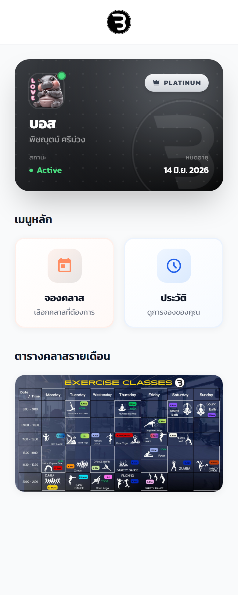
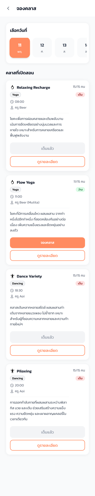
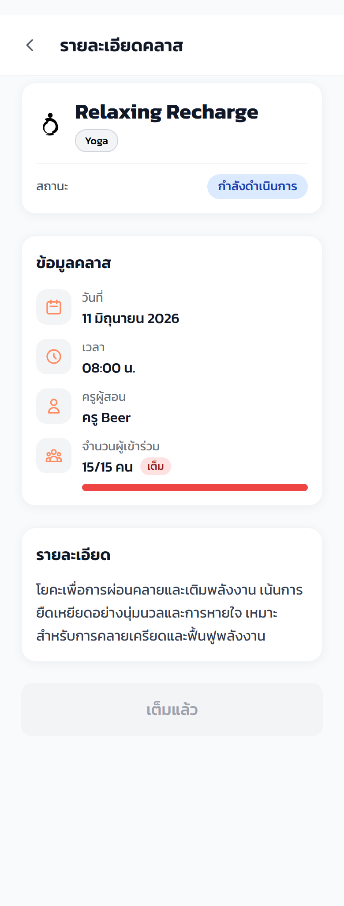
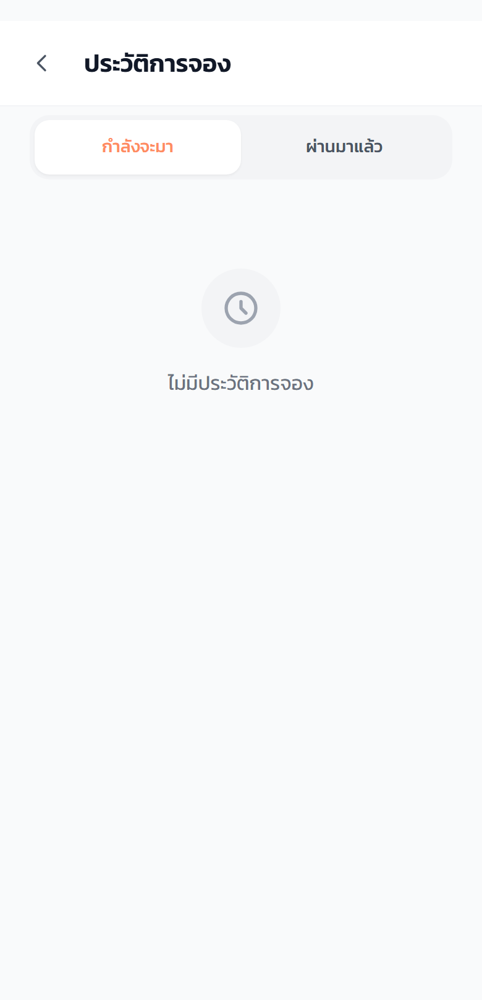
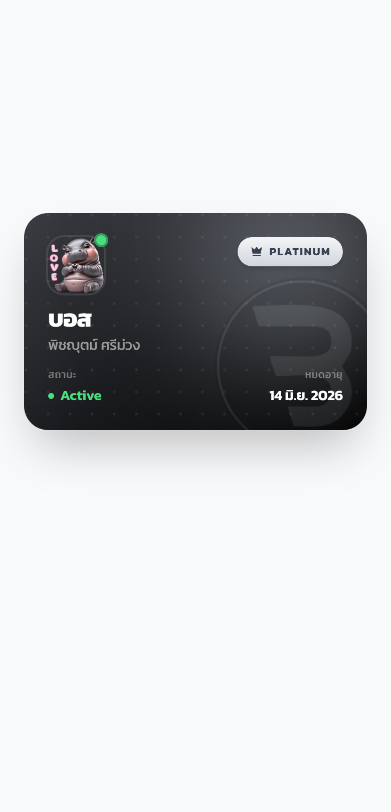
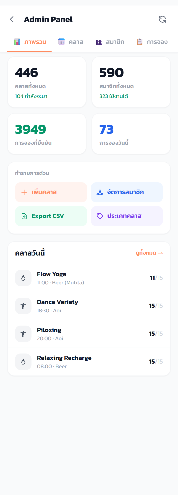
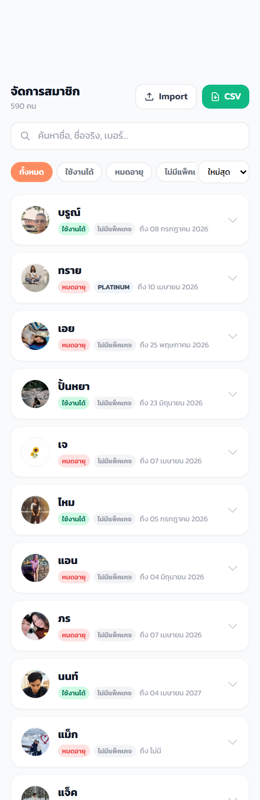
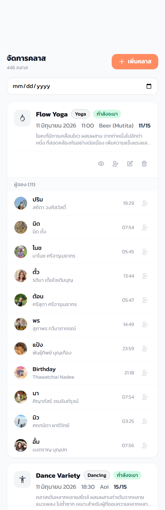

# คู่มือการใช้งาน Black Fitness — ระบบจองคลาส

ระบบจองคลาสออกกำลังกายของ Black Fitness ใช้งานผ่าน LINE (LINE LIFF) บนมือถือ
สมาชิกสามารถดูบัตรสมาชิก จองคลาส ดูประวัติการจอง และผู้ดูแลระบบสามารถจัดการคลาส
สมาชิก และดูสถิติได้จากแอปเดียว

> เอกสารนี้ใช้ภาพหน้าจอจริงจากระบบ (โหมดทดสอบ) ภาพอยู่ในโฟลเดอร์ `images/`

---

## สารบัญ

1. [เริ่มต้นใช้งาน](#1-เริ่มต้นใช้งาน)
2. [หน้าแรก (บัตรสมาชิก + เมนู)](#2-หน้าแรก)
3. [จองคลาส](#3-จองคลาส)
4. [รายละเอียดคลาส](#4-รายละเอียดคลาส)
5. [ประวัติการจอง](#5-ประวัติการจอง)
6. [บัตรสมาชิกดิจิทัล](#6-บัตรสมาชิกดิจิทัล)
7. [สำหรับผู้ดูแลระบบ (Admin)](#7-สำหรับผู้ดูแลระบบ-admin)
8. [คำถามที่พบบ่อย](#8-คำถามที่พบบ่อย)

---

## 1. เริ่มต้นใช้งาน

1. เปิดแอปจากเมนูใน LINE Official Account ของ Black Fitness
2. ระบบจะเข้าสู่ระบบให้อัตโนมัติด้วยบัญชี LINE ของคุณ
3. ผู้ใช้ใหม่จะต้องกรอกข้อมูลโปรไฟล์ก่อน (ชื่อ-นามสกุล, ชื่อเล่น, เบอร์โทร,
   วันเกิด, เป้าหมายการออกกำลังกาย และยอมรับเงื่อนไข) จากนั้นจึงเริ่มใช้งานได้

หลังเข้าสู่ระบบสำเร็จ จะเห็น 4 เมนูหลักที่แถบล่างของจอ คือ
**หน้าแรก · จองคลาส · ประวัติ · จัดการ** (เมนู "จัดการ" จะแสดงเฉพาะผู้ดูแลระบบ)

---

## 2. หน้าแรก

หน้าแรกแสดง:

- **บัตรสมาชิก** ด้านบน — แสดงชื่อเล่น ชื่อจริง ระดับสมาชิก (เช่น PLATINUM)
  สถานะ (Active) และวันหมดอายุสมาชิก
- **เมนูหลัก** — ปุ่มลัดไป "จองคลาส" และ "ประวัติ"
- **ตารางคลาสรายเดือน** — ภาพรวมคลาสทั้งเดือนแบบตาราง
- เมื่อมีประกาศใหม่ จะมีหน้าต่าง "มีอะไรใหม่?" เด้งขึ้นมา กด **รับทราบ** เพื่อปิด
  หรือ **ไม่แสดงอีก** เพื่อไม่ให้ขึ้นอีก

---

## 3. จองคลาส

หน้านี้ใช้เลือกและจองคลาส:

1. **เลือกวันที่** — แถบเลือกวันด้านบน เลื่อนเพื่อดูวันถัดไป (จองล่วงหน้าได้สูงสุด 14 วัน)
2. **คลาสที่เปิดสอน** — แต่ละการ์ดแสดงชื่อคลาส ประเภท (Yoga / Dancing) เวลา
   ครูผู้สอน และจำนวนผู้เข้าร่วม เช่น `11/15`
3. สถานะคลาส:
   - **ว่าง** — กดปุ่ม **จองคลาส** (สีส้ม) เพื่อจองได้ทันที
   - **เต็ม** — ปุ่มจะเป็น **เต็มแล้ว** (กดไม่ได้)
4. กด **ดูรายละเอียด** เพื่อดูข้อมูลคลาสเพิ่มเติมก่อนจอง

> เมื่อจองสำเร็จ ระบบจะตัดสิทธิ์ที่นั่งทันทีและป้องกันการจองเกินจำนวน (กันการจองชนกัน)

---

## 4. รายละเอียดคลาส

เมื่อกด "ดูรายละเอียด" จากคลาสใดคลาสหนึ่ง จะเห็น:

- ชื่อคลาสและประเภท
- สถานะคลาส (เช่น กำลังดำเนินการ / เปิดจอง)
- วันที่จัดคลาส
- ครูผู้สอน
- จำนวนผู้เข้าร่วม พร้อมแถบแสดงความเต็ม (เช่น 15/15 = เต็ม)
- คำอธิบายรายละเอียดคลาส
- ปุ่มจองด้านล่าง (หรือ **เต็มแล้ว** หากที่นั่งเต็ม)

---

## 5. ประวัติการจอง

ดูรายการคลาสที่เคยจอง แบ่งเป็น 2 แท็บ:

- **กำลังจะมา** — คลาสที่จองไว้และยังไม่ถึงเวลา (สามารถยกเลิกได้จากที่นี่)
- **ผ่านมาแล้ว** — ประวัติคลาสที่ผ่านไปแล้ว

หากยังไม่มีการจอง จะแสดงข้อความ "ไม่มีประวัติการจอง"

---

## 6. บัตรสมาชิกดิจิทัล

บัตรสมาชิกดิจิทัลแสดง:

- รูปโปรไฟล์และชื่อเล่น/ชื่อจริง
- ระดับสมาชิก (เช่น PLATINUM) พร้อมไอคอนมงกุฎ
- สถานะสมาชิก (Active / หมดอายุ)
- วันหมดอายุสมาชิก

ใช้แสดงตัวตนเมื่อเข้าใช้บริการที่สาขา สามารถเปิดได้จากหน้าแรกหรือลิงก์บัตรสมาชิก

---

## 7. สำหรับผู้ดูแลระบบ (Admin)

ผู้ที่มีสิทธิ์ **admin** หรือ **staff** จะเห็นเมนู **จัดการ** ที่แถบล่าง
เมื่อกดเข้าไปจะพบ Admin Panel ที่มี 4 แท็บ: **ภาพรวม · คลาส · สมาชิก · การจอง**

### 7.1 ภาพรวม (Dashboard)

แสดงสถิติสำคัญแบบเรียลไทม์:

- **คลาสทั้งหมด** และจำนวนคลาสที่กำลังจะมาถึง
- **สมาชิกทั้งหมด** และจำนวนที่ยังใช้งานได้ (active)
- **การจองที่ยืนยันแล้ว**
- **การจองวันนี้**

พร้อมปุ่มทำรายการด่วน: **เพิ่มคลาส · จัดการสมาชิก · Export CSV · ประเภทคลาส**
และรายการ **คลาสวันนี้** ด้านล่าง

### 7.2 จัดการสมาชิก

- ค้นหาสมาชิกด้วยช่อง **ค้นหา...** (ชื่อเล่น/ชื่อจริง)
- แต่ละรายการแสดงรูป ชื่อ สิทธิ์ (Admin/Staff) และวันหมดอายุสมาชิก
  (สีแดง = หมดอายุแล้ว, สีเขียว = ยังใช้งานได้)
- กดไอคอนดินสอเพื่อ **แก้ไขข้อมูลสมาชิก** (รวมถึงต่ออายุ/ปรับระดับสมาชิก)

### 7.3 จัดการคลาส

- กรองคลาสตามวันที่ด้วยช่องเลือกวันที่ (กด **ล้าง** เพื่อล้างตัวกรอง)
- กด **เพิ่มคลาส** (ปุ่มสีส้มมุมขวาบน) เพื่อสร้างคลาสใหม่
- แต่ละการ์ดแสดงชื่อคลาส ครูผู้สอน เวลา และจำนวนผู้เข้าร่วม
- กดไอคอนถังขยะเพื่อลบคลาส

> **ข้อควรระวัง:** การลบคลาสมีผลกับการจองที่มีอยู่ ควรตรวจสอบก่อนลบทุกครั้ง

---

## 8. คำถามที่พบบ่อย

**Q: จองคลาสล่วงหน้าได้กี่วัน?**
A: จองล่วงหน้าได้สูงสุด 14 วัน

**Q: ยกเลิกการจองได้ไหม?**
A: ได้ ที่แท็บ "กำลังจะมา" ในหน้าประวัติการจอง (อาจมีช่วงเวลา cooldown หลังยกเลิก)

**Q: ทำไมจองคลาสไม่ได้?**
A: ตรวจสอบว่า (1) คลาสยังว่างอยู่ (ไม่ใช่ "เต็มแล้ว") (2) สมาชิกยังไม่หมดอายุ
และ (3) ไม่ติดช่วง cooldown จากการยกเลิกก่อนหน้า

**Q: บัตรสมาชิกหมดอายุ ทำอย่างไร?**
A: ติดต่อเจ้าหน้าที่ที่สาขาเพื่อต่ออายุ ผู้ดูแลระบบจะอัปเดตวันหมดอายุให้ในระบบ

---

*คู่มือนี้จัดทำจากระบบเวอร์ชันปัจจุบัน หากหน้าจอจริงต่างจากภาพ ให้ยึดตามระบบล่าสุด*
